# yolov5网络学习

## 网络结构

### 版本比较

官方给出的目标检测网络中一共有4个版本，分别是**Yolov5s、Yolov5m、Yolov5l、Yolov5x**四个模型，™结构基本一样，不同的是depth_multiple（模型深度）和width_multiple（模型宽度）这两个参数

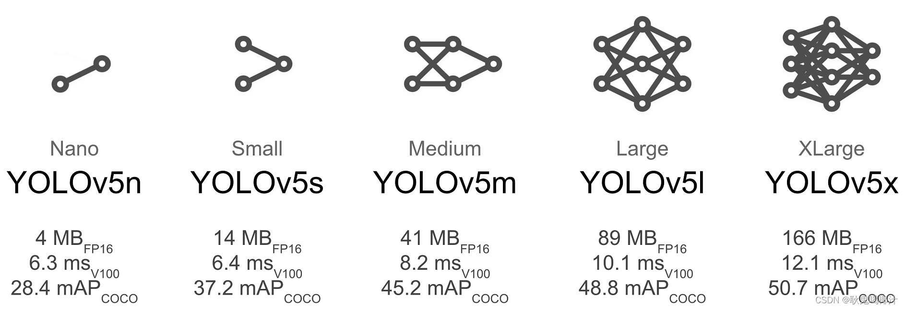

### 

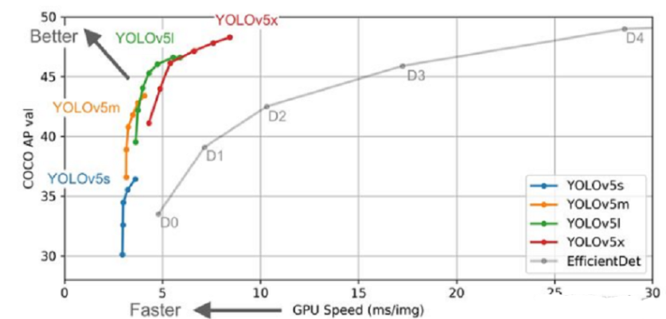

要快选s,gpu跑得动要质量就选x；或者说测试用s,成品用x

### 组成

- **骨干网络（Backbone）**: New CSP-Darknet53

  主要指用于特征提取的，已在大型数据集(例如ImageNet|COCO等)上完成预训练，拥有预训练参数的卷积神经网络，例如：ResNet-50、Darknet53等

- **颈部网络(Neck)**: SPPF, New CSP-PAN

  颈部网络，在Backone和Head之间，会添加一些用于收集不同阶段中特征图的网络层。
  基于深度学习的目标检测模型的结构是这样的：输入->主干->脖子->头->输出。主干网络提取特征，脖子提取一些更复杂的特征，然后头部计算预测输出。

- **头部网络（Head）**: YOLOv3 Head

  检测头/头部网络，主要用于预测目标的种类和位置(bounding boxes)

YOLOv5基本组件：

- Focus：基本上就是YOLO v2的passthrough。

- CBL：由Conv+Bn+Leaky_relu激活函数三者组成。

- CSP1_X：借鉴CSPNet网络结构，由三个卷积层和X个Res unint模块Concate组成。

- CSP2_X：不再用Res unint模块，而是改为CBL。

- SPP：采用1×1，5×5，9×9，13×13的最大池化的方式，进行多尺度融合。

  

### 输入端

#### mosaic数据增强

Mosaic数据增强则采用了4张图片，随机缩放、随机裁剪、随机排布的方式进行拼接，使模型在更小的范围内识别目标。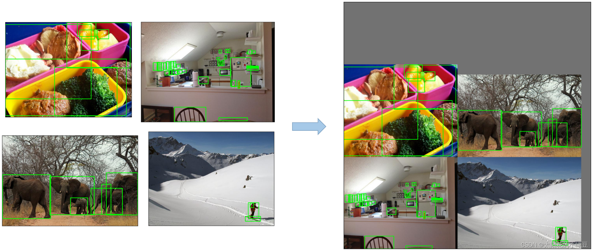

**主要步骤**

1. 随机选取图片拼接基准点坐标（xc，yc），随机选取四张图片。
2. 四张图片根据基准点，分别经过尺寸调整和比例缩放后，放置在指定尺寸的大图的左上，右上，左下，右下位置。
3. 根据每张图片的尺寸变换方式，将映射关系对应到图片标签上。
4. 依据指定的横纵坐标，对大图进行拼接。处理超过边界的检测框坐标。

**优点**

- 丰富数据集： 随机使用4张图像，随机缩放后随机拼接，增加很多小目标，大大增加了数据多样性。

- 增强模型鲁棒性： 混合四张具有不同语义信息的图片，可以让模型检测超出常规语境的目标。

- 加强批归一化（Batch Normalization）的效果： 当模型设置 BN 操作后，训练时会尽可能增大批样本总量（BatchSize），因为 BN 原理为计算每一个特征层的均值和方差，如果批样本总量越大，那么 BN 计算的均值和方差就越接近于整个数据集的均值和方差，效果越好。

  （BN介绍见[什么是批标准化 (Batch Normalization) - 知乎 (zhihu.com)](https://zhuanlan.zhihu.com/p/24810318)）

- 有利于提升小目标检测性能： Mosaic 数据增强图像由四张原始图像拼接而成，这样每张图像会有更大概率包含小目标，从而提升了模型的检测能力。

####  自适应锚框计算

anchor box介绍[锚框：Anchor box综述 - 知乎 (zhihu.com)](https://zhuanlan.zhihu.com/p/63024247)

在YOLOv3和YOLOv4中，训练不同的数据集，都是通过单独的程序运行来获得初始锚点框。在 YOLOv5 中，则是将此功能嵌入到整个训练代码里中。所以在每次训练开始之前，它都会根据不同的数据集来自适应计算不同训练集中的最佳锚框值。

自适应的计算具体过程：

1. 获取数据集中所有目标的宽和高。

2. 将每张图片中按照等比例缩放的方式到 resize 指定大小，这里保证宽高中的最大值符合指定大小。

3. 将 bboxes 从相对坐标改成绝对坐标，这里乘以的是缩放后的宽高。

4. 筛选 bboxes，保留宽高都大于等于两个像素的 bboxes。

5. 使用 k-means 聚类三方得到n个 anchors，与YOLOv3、YOLOv4 操作一样。

6. 使用遗传算法随机对 anchors 的宽高进行变异。倘若变异后的效果好，就将变异后的结果赋值给 anchors；如果变异后效果变差就跳过，默认变异1000次。这里是使用 anchor_fitness 方法计算得到的适应度 fitness，然后再进行评估。 

   

#### 自适应图片放缩

在目标检测算法中，不同的图片的长宽都不相同，因此常用的方式是将原始图片统一缩放到一个标准尺寸，再送入检测网络中

YOLO算法中常用**416\*416**等尺寸。原始图片先进行放缩， 原始缩放尺寸是416*416，除以原始图像尺寸得到放缩系数，选择小的进行放缩，进一步计算黑边填充数值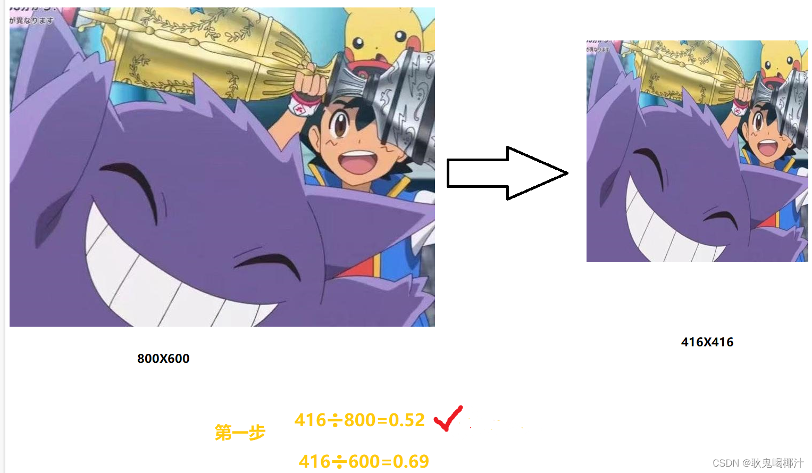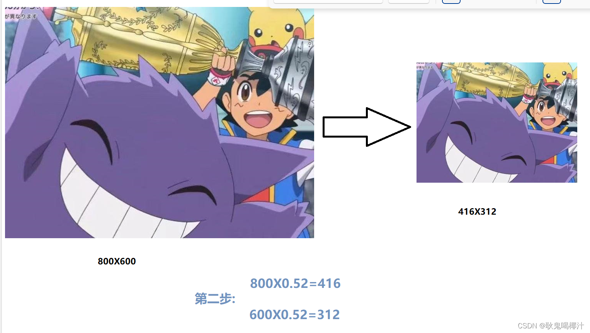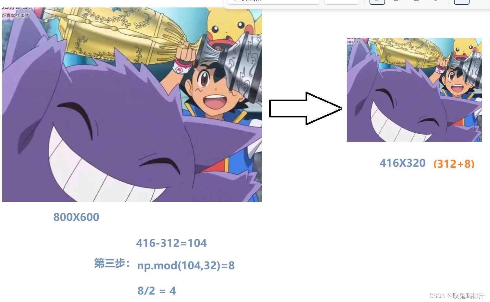

注意：

1. Yolov5中填充的是灰色，即（114,114,114）。

2. 训练时没有采用缩减黑边的方式，还是采用传统填充的方式，即缩放到416*416大小。只是在测试，使用模型推理时，才采用缩减黑边的方式，提高目标检测，推理的速度。

3. 为什么np.mod函数的后面用32？

   因为YOLOv5的网络经过5次下采样，而2的5次方，等于32。所以至少要去掉32的倍数，再进行取余。以免产生尺度太小走不完stride（filter在原图上扫描时，需要跳跃的格数）的问题，再进行取余。

### 骨干网络（backbone)

#### Focus结构

 Focus模块在YOLOv5中是图片进入Backbone前，对图片进行切片操作，具体操作是在一张图片中每隔一个像素拿到一个值，类似于邻近下采样，这样就拿到了四张图片，四张图片互补，长得差不多，但是没有信息丢失，这样一来，将W、H信息就集中到了通道空间，输入通道扩充了4倍，即拼接起来的图片相对于原先的RGB三通道模式变成了12个通道，最后将得到的新图片再经过卷积操作，最终得到了没有信息丢失情况下的二倍下采样特征图。
       以YOLOv5s为例，原始的640 × 640 × 3的图像输入Focus结构，采用切片操作，先变成320 × 320 × 12的特征图，再经过一次卷积操作，最终变成320 × 320 × 32的特征图。
切片操作如下：

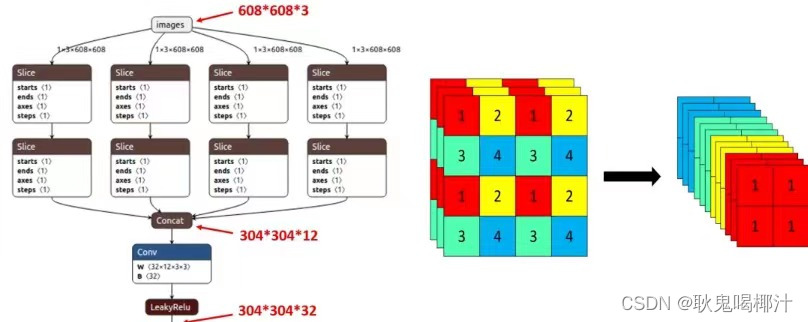

作用： 可以使信息不丢失的情况下提高计算力

不足：Focus 对某些设备不支持且不友好，开销很大，另外切片对不齐的话模型就崩了。

后期改进： 在新版中，YOLOv5 将Focus 模块替换成了一个 6 x 6 的卷积层。两者的计算量是等价的，但是对于一些 GPU 设备，使用 6 x 6 的卷积会更加高效。

#### CSP结构

 CSPNet主要是将feature map拆成两个部分，一部分进行卷积操作，另一部分和上一部分卷积操作的结果进行concate。

在目标检测问题中，使用CSPNet作为Backbone带来的提升比较大，可以有效增强CNN的学习能力，同时也降低了计算量。 

 虽然YOLOv4与YOLOv5都是用了CSP结构，但YOLOv5与其不同点在于：YOLOv4中只有主干网络使用了CSP结构。 而YOLOv5中设计了两种CSP结构，以YOLOv5s网络为例，CSP1_ X结构应用于Backbone主干网络，而CSP2_X结构则应用于Neck中。下图清楚的表示出来了：

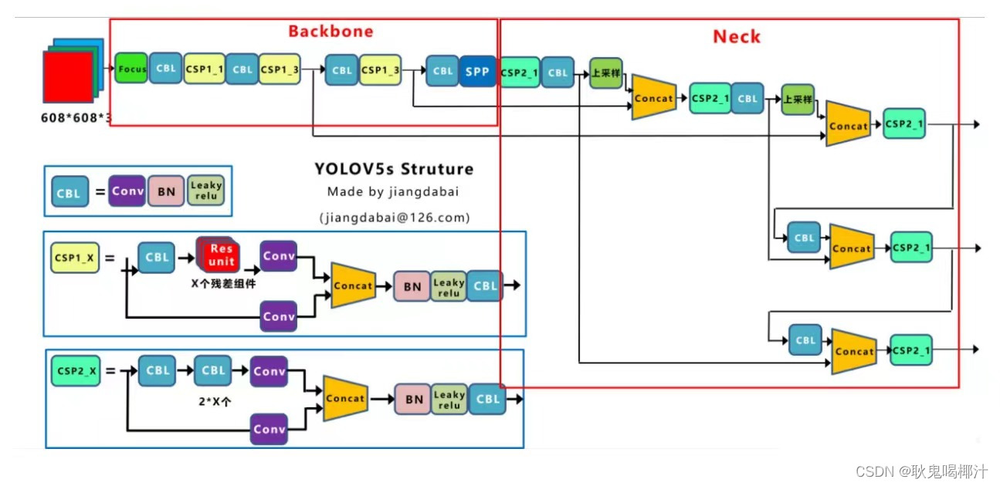

### 颈部网络（Neck)

 YOLOv5与YOLOv4的颈部网络（Neck）都采用FPN+PAN的结构。但是在它的基础上做了一些改进操作：YOLOV4的Neck结构中，采用的都是普通的卷积操作，而YOLOV5的Neck中，采用CSPNet设计的CSP2结构，从而加强了网络特征融合能力

FPN-PAN结构如下图所示，FPN层自顶向下传达强语义特征，而PAN塔自底向上传达定位特征：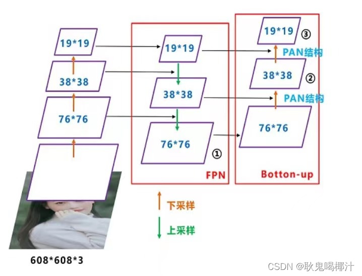

### 头部网络（Head)

#### Bounding box损失函数

 YOLO v5采用CIOU_LOSS 作为bounding box 的损失函数。下面依次对IOU_Loss、GIOU_Loss、DIOU_Loss以及CIOU_Loss进行介绍。

##### IOU_Loss

[IoU Loss 系列（常规篇） - 知乎 (zhihu.com)](https://zhuanlan.zhihu.com/p/388622389)

**IOU_Loss**：**预测框与GT框之间的交集/预测框与GT框之间的并集**

传统回归loss都是回归表征一个矩形框的四个变量，但这基于一个过于简化的假设，即这四个变量之间是相互独立的。实际上，这四个变量之间是相互关联的，简单的分开计算每个变量的回归loss无法反映这种相关性，而将预测框与GT框之间的iou引入回归loss则很好的解决了这一问题。

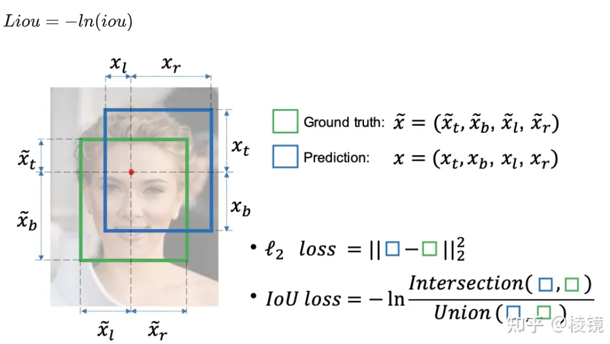

##### G-IoU Loss

G-IoU Loss指出iou loss存在问题

1）iou loss在预测框与GT框不相交时，iou为0如果作为损失函数其梯度是0，无法优化参数，并且其无法反映不相交的预测框与GT框的远近，因为不论远近只要不相交iou都是0（笔者存疑，实际上目标检测算正样本回归loss的时候，都经过了正负样本匹配，无论是anchor机制还是anchor free机制，都能保证正样本和GT是有一定重合度的，最多可能出现在anchor机制训练早期，有点儿牵强）；

2）预测框与GT框之间的iou不能完全反映重合的好坏，如下图三种情况的iou一致，但论文认为第一种情况最理想，对应的giou更高（笔者仍然存疑，模型评价本就是基于iou匹配，而且对于下图第一种情况重合更理想并不认同，第三种情况的giou更是-0.1，前两种giou分别是0.33、0.24，不合理。关于第二点的描述以及下图其实在论文里已经被删，但笔者在一些专栏及博客中仍有见到，特此说明，如有理解不当，请指正）。

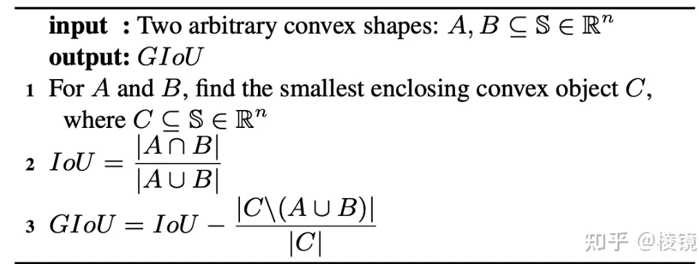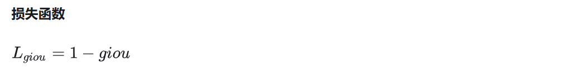

实践中giou loss 的效果并不明显

#####  D-IoU Loss与C-IoU Loss

认为好的检测回归loss应该考虑三个几何度量，预测框和GT框的重叠度、中心点距离、长宽比的一致性。于是在iou loss和giou loss基础上引入预测框和GT框中心点距离作diou loss，在diou loss基础上引入了预测框的长宽比和GT框的长宽比之间的差异作ciou loss。此外，将diou加入nms替代iou，提升了nms的鲁棒性。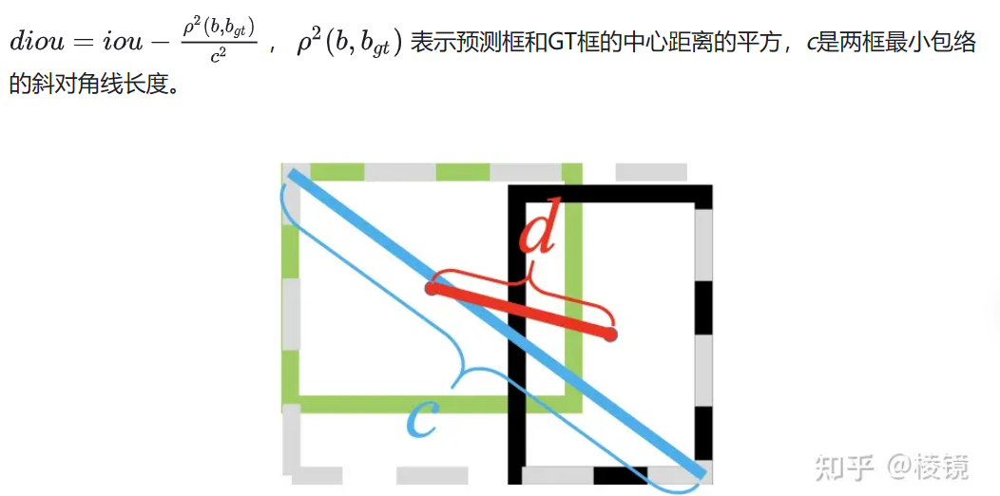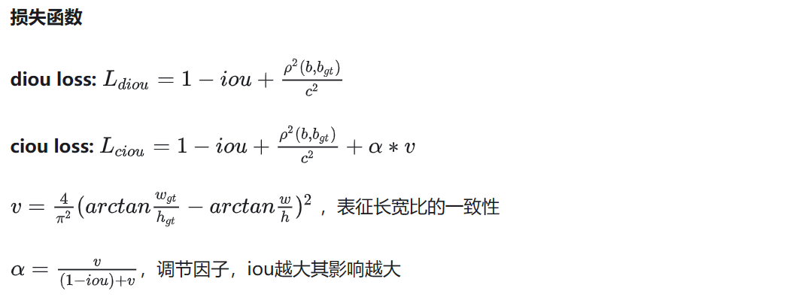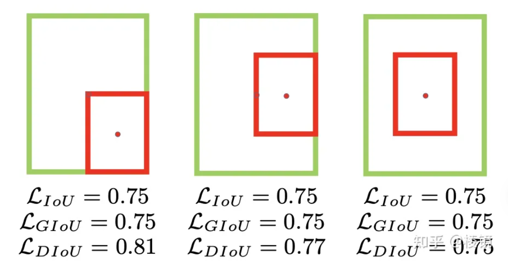

#####  E-IoU Loss与Focal E-IoU Loss

认为ciou loss对于长宽比的加入loss的设计不太合理，于是将ciou loss中反应长宽比一致性的部分替换成了分别对于长和宽的一致性loss，形成了eiou loss（从后面公式可以看出，其实这样就退化成了对于长和宽预测的l2 loss，所以理论上来看比较鸡肋）。真正比较有意思也更有价值的是第二点，认为不太好的回归样本对回归loss产生了比较大的影响，回归质量相对较好的样本则难以进一步优化（个人思考一方面在于样本本身确实回归的质量不太好，另一方面在于训练数据中GT框不一定准而且对于遮挡等情况目标的边界是不明确的） ，所以论文提出focal eiou loss进行回归质量较好和质量较差的样本之间的平衡。

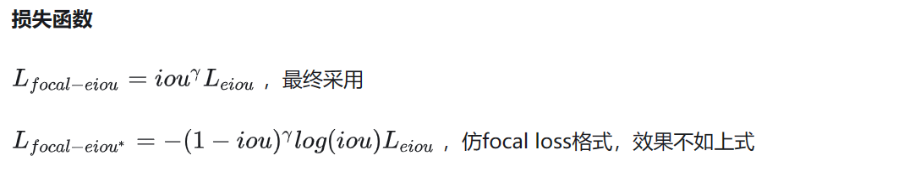

#### NMS非极大值抑制

NMS 的本质是搜索局部极大值，抑制非极大值元素。  非极大值抑制，主要就是用来抑制检测时冗余的框。因为在目标检测中，在同一目标的位置上会产生大量的候选框，这些候选框相互之间可能会有重叠，所以我们需要利用非极大值抑制找到最佳的目标边界框，消除冗余的边界框。

算法流程：

  1.对所有预测框的置信度降序排序
  2.选出置信度最高的预测框，确认其为正确预测，并计算他与其他预测框的 IOU。
  3.根据步骤2中计算的 IOU 去除重叠度高的，IOU > threshold 阈值就直接删除。
  4.剩下的预测框返回第1步，直到没有剩下的为止.

SoftNMS：
      当两个目标靠的非常近时，置信度低的会被置信度高的框所抑制，那么当两个目标靠的十分近的时候就只会识别出一个 BBox。为了解决这个问题，可以使用 softNMS。
      它的基本思想是用稍低一点的分数来代替原有的分数，而不是像 NMS 一样直接置零。

### 训练策略

（1）多尺度训练（Multi-scale training）。 如果网络的输入是416 x 416。那么训练的时候就会从 0.5 x 416 到 1.5 x 416 中任意取值，但所取的值都是32的整数倍。
（2）训练开始前使用 warmup 进行训练。 在模型预训练阶段，先使用较小的学习率训练一些epochs或者steps (如4个 epoch 或10000个 step)，再修改为预先设置的学习率进行训练。
（3）使用了 cosine 学习率下降策略（Cosine LR scheduler）。
（4）采用了 EMA 更新权重(Exponential Moving Average)。 相当于训练时给参数赋予一个动量，这样更新起来就会更加平滑。
（5）使用了 amp 进行混合精度训练（Mixed precision）。 能够减少显存的占用并且加快训练速度，但是需要 GPU 支持。