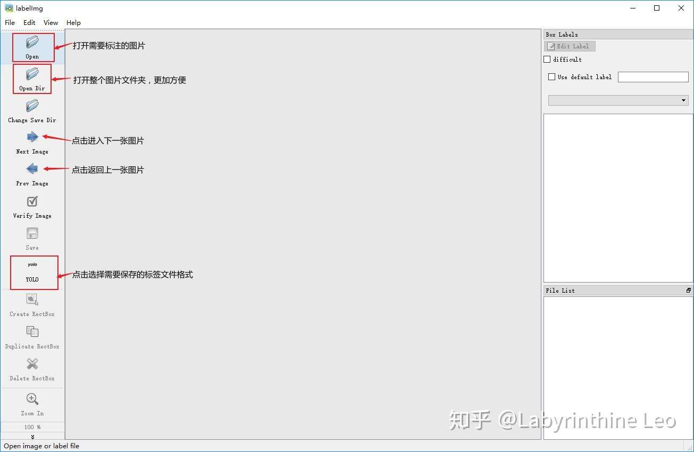
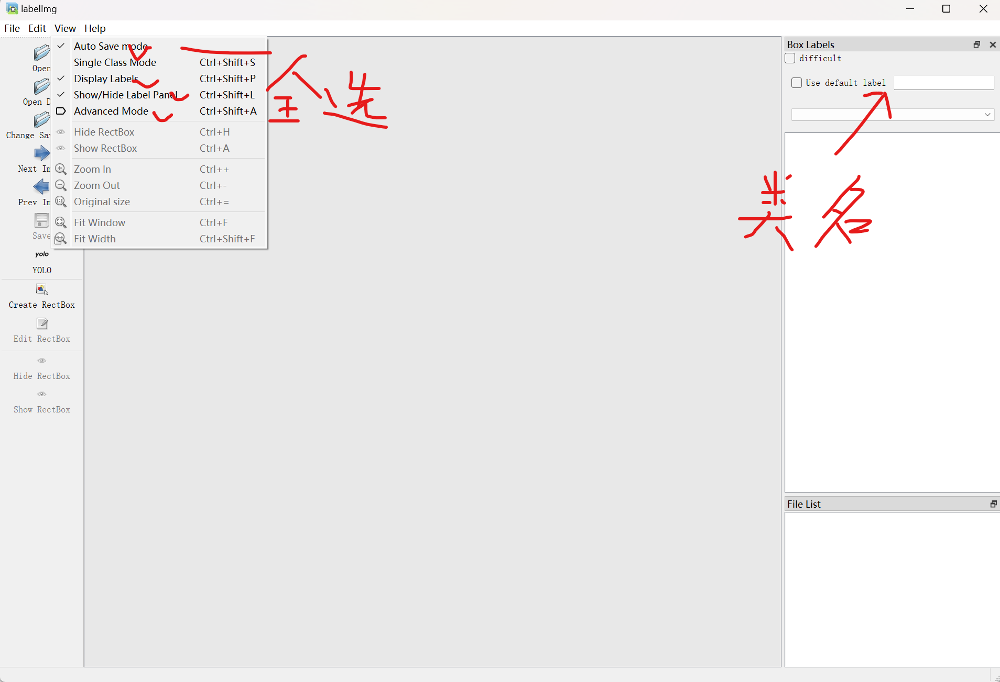

## 自构建数据集训练

### 文件架构

cd D:\codeLibrary\yolov5

再文件夹中找到datasets，于其中新建文件夹，命名为project_name,再于其中新建两个文件夹，分别为images 和labels，其中images存放图片数据，labels 存放标注数据。分别在这两个文件夹中新建两个文件夹train 和val，其中train存放用于训练模型的数据，val用于存放用于验证模型的数据;在labels的两个文件夹中分别存放与之相对应的标注数据

```
|--(project_name)
	|--images
		|--train
			|--0.jpg
			...
		|--val
			|--0.jpg
			...
	|--labels
		|--train
			|--0.txt
			...
		|--val
			|--0.txt
			...
	|--(project_name).yaml
```

### 具体步骤

将训练用文件存放到images/train中，使用任意工具将图片重命名为0.jpg 1.jpg .....

重命名的文件应该从0开始，否则可能会产生一些奇怪的问题

使用labelimg等工具对数据进行标注

以labelimg为例





设置好上述设置，将保存文件夹设为labels/train则可开始标注

常用快捷键：w:标注框选  a:上一张  d:下一张

标注完成后一定要检查生成的txt文件数目和数据集是否一致，不一致后续训练时会报错

从train中转移小部分数据到val用于验证（在images和labels进行相应操作，牢记一一对应）

于(project_name)目录下新建（project_name).txt,在其中写入

```
# Train/val/test sets as 1) dir: path/to/imgs, 2) file: path/to/imgs.txt, or 3) list: [path/to/imgs1, path/to/imgs2, ..]
path: D:\codeLibrary\yolov5\datasets\（project_name）  # dataset root dir
train: images/train/  # train images (relative to 'path')
val: images/val/  # val images (relative to 'path')
test:  # test images (optional)

# Classes
nc: 2  # number of classes 根据打标的类的数目进行修改
names: ['smallduck','bigduck']  # class names，有几个写几个
```

保存后将txt重命名为（project_name).yaml配置文件

接下来需要修改yolov5\models\yolov5s.yaml文件（用其他的预训练模型就修改相应的文件）

```
# Parameters
nc: 2  # number of classes只需要修改这里，改成打标的类的数目
depth_multiple: 0.33  # model depth multiple
width_multiple: 0.50  # layer channel multiple
anchors:
  - [10,13, 16,30, 33,23]  # P3/8
  - [30,61, 62,45, 59,119]  # P4/16
  - [116,90, 156,198, 373,326]  # P5/32
```

然后在yolov5/train.py中找到下列代码

```
def parse_opt(known=False):
    parser = argparse.ArgumentParser()
    parser.add_argument('--weights', type=str, default=ROOT / 'yolov5s.pt', help='initial weights path')
    parser.add_argument('--cfg', type=str, default='', help='model.yaml path')
    parser.add_argument('--data', type=str, default=ROOT / 'datasets/dayilixiang/dayilixiang.yaml', help='dayilixiang.yaml path')
    parser.add_argument('--hyp', type=str, default=ROOT / 'data/hyps/hyp.scratch-low.yaml', help='hyperparameters path')
    parser.add_argument('--epochs', type=int, default=100, help='total training epochs')
    parser.add_argument('--batch-size', type=int, default=16, help='total batch size for all GPUs, -1 for autobatch')
    parser.add_argument('--imgsz', '--img', '--img-size', type=int, default=640, help='train, val image size (pixels)')
    parser.add_argument('--rect', action='store_true', help='rectangular training')
    parser.add_argument('--resume', nargs='?', const=True, default=False, help='resume most recent training')
    parser.add_argument('--nosave', action='store_true', help='only save final checkpoint')
    parser.add_argument('--noval', action='store_true', help='only validate final epoch')
    parser.add_argument('--noautoanchor', action='store_true', help='disable AutoAnchor')
    parser.add_argument('--noplots', action='store_true', help='save no plot files')
    parser.add_argument('--evolve', type=int, nargs='?', const=300, help='evolve hyperparameters for x generations')
    parser.add_argument('--bucket', type=str, default='', help='gsutil bucket')
    parser.add_argument('--cache', type=str, nargs='?', const='ram', help='image --cache ram/disk')
    parser.add_argument('--image-weights', action='store_true', help='use weighted image selection for training')
    parser.add_argument('--device', default='', help='cuda device, i.e. 0 or 0,1,2,3 or cpu')
    parser.add_argument('--multi-scale', action='store_true', help='vary img-size +/- 50%%')
    parser.add_argument('--single-cls', action='store_true', help='train multi-class data as single-class')
    parser.add_argument('--optimizer', type=str, choices=['SGD', 'Adam', 'AdamW'], default='SGD', help='optimizer')
    parser.add_argument('--sync-bn', action='store_true', help='use SyncBatchNorm, only available in DDP mode')
    parser.add_argument('--workers', type=int, default=8, help='max dataloader workers (per RANK in DDP mode)')
    parser.add_argument('--project', default=ROOT / 'runs/train', help='save to project/name')
    parser.add_argument('--name', default='exp', help='save to project/name')
    parser.add_argument('--exist-ok', action='store_true', help='existing project/name ok, do not increment')
    parser.add_argument('--quad', action='store_true', help='quad dataloader')
    parser.add_argument('--cos-lr', action='store_true', help='cosine LR scheduler')
    parser.add_argument('--label-smoothing', type=float, default=0.0, help='Label smoothing epsilon')
    parser.add_argument('--patience', type=int, default=100, help='EarlyStopping patience (epochs without improvement)')
    parser.add_argument('--freeze', nargs='+', type=int, default=[0], help='Freeze layers: backbone=10, first3=0 1 2')
    parser.add_argument('--save-period', type=int, default=-1, help='Save checkpoint every x epochs (disabled if < 1)')
    parser.add_argument('--seed', type=int, default=0, help='Global training seed')
    parser.add_argument('--local_rank', type=int, default=-1, help='Automatic DDP Multi-GPU argument, do not modify')

    # Logger arguments
    parser.add_argument('--entity', default=None, help='Entity')
    parser.add_argument('--upload_dataset', nargs='?', const=True, default=False, help='Upload data, "val" option')
    parser.add_argument('--bbox_interval', type=int, default=-1, help='Set bounding-box image logging interval')
    parser.add_argument('--artifact_alias', type=str, default='latest', help='Version of dataset artifact to use')

    return parser.parse_known_args()[0] if known else parser.parse_args()
```

主要修改几个参数

```
--weights  选预训练模型路径
--data 配置文件路径 即（project_name).yaml的路径
--epochs 训练轮次 100-300不等
--batch-size 单次投喂数据量  根据电脑配置选择 8 16 32
--device 用cpu就填cpu 用gpu就根据电脑有几块gpu填写，填0则使用gpu0进行训练
--workers 线程数 应为8的倍数最快
--project 保存路径
```


### 报错解决

```
AssertionError: train: No labels found in /VOCdevkit/VOC2007/train.cache, can not start training.
```

解决方法：
1、检测数据集生成txt文件及路径
2、查看VOC.yaml数据集配置文件是否修改
3、查看yolov5s.yaml模型配置文件是否修改
4、……